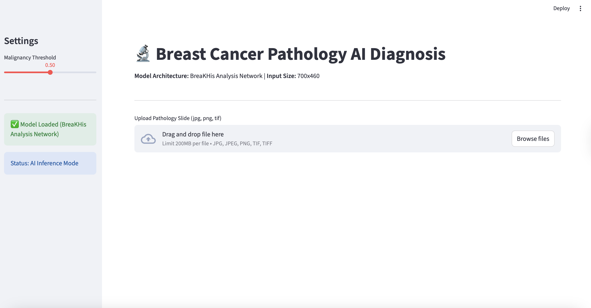
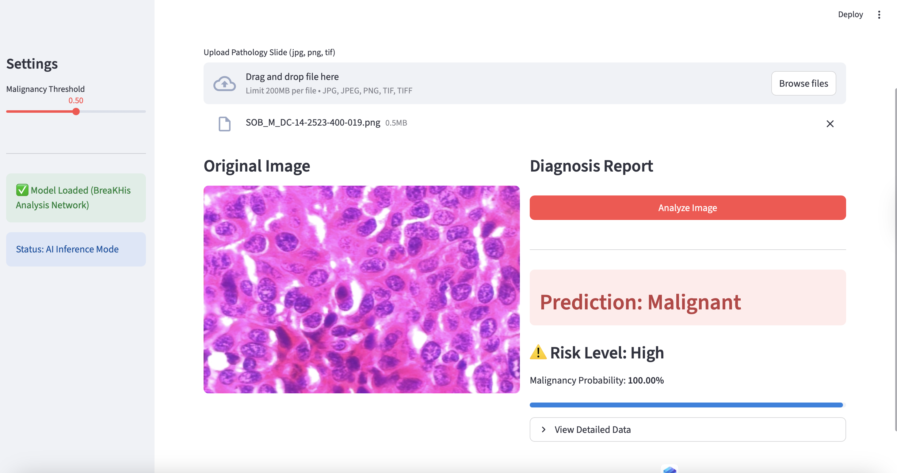

<<<<<<< HEAD
# 🔬 Breast Cancer Pathology AI Diagnosis


## Overview

This project is a deep learning-based web application designed to assist in the classification of breast cancer pathology images (Histopathology). It utilizes a fine-tuned **ResNet18** neural network to distinguish between **Benign** (low risk) and **Malignant** (high risk) tissue samples.

Built with **Streamlit** and **PyTorch**, the system provides a clean, user-friendly interface for researchers and medical professionals to perform real-time image analysis.

## Features

* **Automated Diagnosis**: Instantly classifies uploaded pathology slides (JPG, PNG, TIF).
* **Deep Learning Core**: Powered by a ResNet18 model fine-tuned on the **BreaKHis 400X** dataset.
* **Confidence Metrics**: Displays precise probability scores and categorical risk levels.
* **Adjustable Sensitivity**: Includes a sidebar slider to adjust the "Malignancy Threshold," allowing users to balance sensitivity vs. specificity based on clinical needs.
* **Clean UI**: A fully English, internationalized interface optimized for ease of use.

##  Application Demo

### 1. Main Interface
The clean and intuitive upload interface.


### 2. Analysis Result: Malignant
Detection of high-risk tissue with high confidence.


### 3. Analysis Result: Benign
Detection of low-risk tissue.
.

### Steps: 

#### Step 1: Clone the Repository
```bash
git clone 
```
#### Step 2: Install Dependencies
Install the required Python libraries using pip:
```bash
pip install -r requirements.txt
```

(Make sure requirements.txt includes: streamlit, torch, torchvision, pillow)

#### Step 3: Model Setup
Ensure the pre-trained model file is placed in the root directory:
Filename: resnet18_best.pth
Note: If the model is missing, you can retrain it using the provided Resnet18.ipynb notebook.

###  Usage
To launch the application, run the following command in your terminal:

```bash 
streamlit run app.py
```
The application will automatically open in your default web browser (usually at http://localhost:8501).

Upload: Drag and drop a pathology image into the file uploader.

Analyze: Click the "Analyze Image" button.

Result: View the prediction, risk level, and probability bar.

Settings: Use the sidebar to adjust the diagnosis threshold if needed.

###  Model Technical Details
Architecture: ResNet18 (Pre-trained on ImageNet).

Input Resolution: 700x460 pixels (Resized automatically during preprocessing).

Normalization Statistics:

Mean: [0.756, 0.589, 0.742]

Std: [0.143, 0.201, 0.116]

Optimization: Trained using CrossEntropyLoss and Adam optimizer.


###  Disclaimer
For Research and Educational Purposes Only. This tool is intended to demonstrate the capabilities of artificial intelligence in medical imaging analysis. It is not a certified medical device and should not be used for final clinical diagnosis or treatment decisions without the supervision of a qualified pathologist or medical professional.

