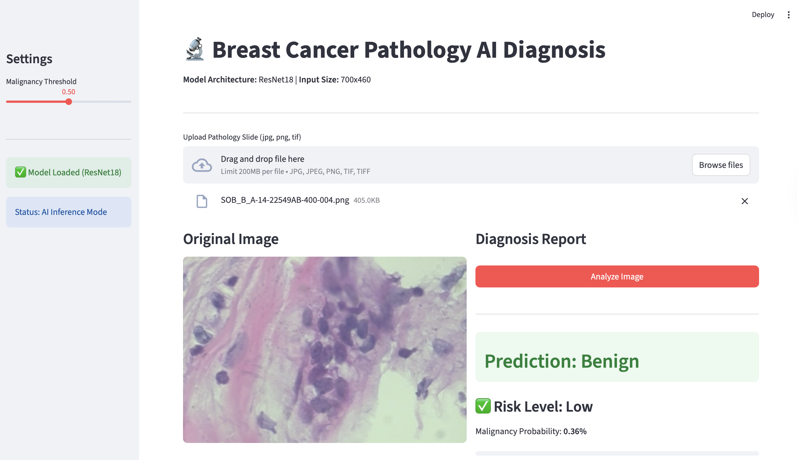

<<<<<<< HEAD
#  Breast Cancer Pathology AI Diagnosis


## Overview

This project is a deep learning-based web application designed to assist in the classification of breast cancer pathology images (Histopathology). It utilizes a fine-tuned **BreaKHis Analysis Network** to distinguish between **Benign** (low risk) and **Malignant** (high risk) tissue samples.

Built with **Streamlit** and **PyTorch**, the system provides a clean, user-friendly interface for researchers and medical professionals to perform real-time image analysis.

## Features

* **400X Magnification Optimized**: The model is specifically trained on **400x magnification** images (BreaKHis 400X dataset) for high-precision cellular analysis.
* **Automated Diagnosis**: Instantly classifies uploaded pathology slides (JPG, PNG, TIF).
* **Confidence Metrics**: Displays precise probability scores and categorical risk levels.
* **Adjustable Sensitivity**: Includes a sidebar slider to adjust the "Malignancy Threshold," allowing users to balance sensitivity vs. specificity based on clinical needs.
* **Clean UI**: A fully English, internationalized interface optimized for ease of use.

##  Application Demo

### 1. Main Interface
The clean and intuitive upload interface.


### 2. Analysis Result: Malignant
Detection of high-risk tissue with high confidence.


### 3. Analysis Result: Benign
Detection of low-risk tissue.


## Installation

#### Step 1: Clone the Repository
Clone the project and navigate to the GUI directory:
```bash
git clone https://github.com/RainbowBombs/BIA_course_2025-26_Group09.git
cd BIA_course_2025-26_Group09/GUI
```

#### Step 2: Install Dependencies
Install the required Python libraries using pip:
```bash
pip install -r requirements.txt
```

(Make sure requirements.txt includes: streamlit, torch, torchvision, pillow)

#### Step 3: Model Setup
Ensure the pre-trained model file is placed in the root directory:
Filename: BreaKHis Analysis Network_best.pth

###  Usage
To launch the application, run the following command in your terminal:

```bash 
streamlit run app.py
```
The application will automatically open in your default web browser (usually at http://localhost:8501).

1. Upload: Drag and drop a pathology image into the file uploader.

**Important Note**: Please ensure the input image is at 400x magnification. Using images with other magnification levels (e.g., 40x, 100x, 200x) may result in inaccurate predictions as the model focuses on cellular details visible at 400x.

2. Analyze: Click the "Analyze Image" button.

3. Result: View the prediction, risk level, and probability bar.

4. Settings: Use the sidebar to adjust the diagnosis threshold if needed.

###  Model Technical Details
Architecture: BreaKHis Analysis Network (Pre-trained on ImageNet).

Input Resolution: 700x460 pixels (Resized automatically during preprocessing).

Normalization Statistics:

Mean: [0.756, 0.589, 0.742]

Std: [0.143, 0.201, 0.116]

Optimization: Trained using CrossEntropyLoss and Adam optimizer.


